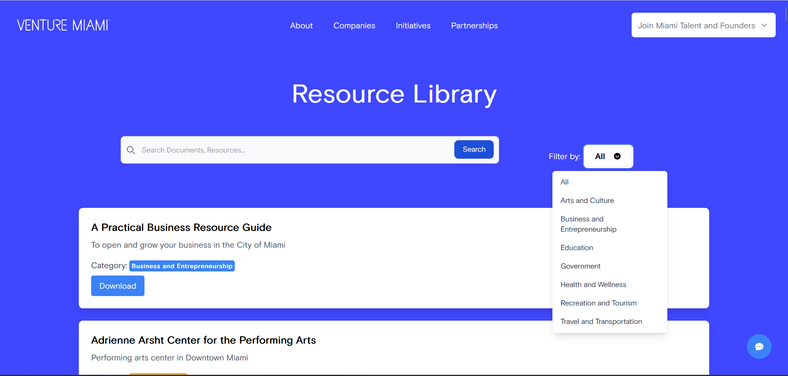

# Pull Request

## Description
This pull request introduces several new features and improvements to the project.

## Changes Made

### Contact Form:
* Implemented a contact form when the user clicks the 'contact-us' link that displays a modal of a contact form which makes the process of submitting a query feel more internal, as the previous implementation opens up the default mail client.
* There is a blank link for the card to contact via dm, which I wanted to set the link to.
* Considering adding form validation, anti-spam measures, and a confirmation message to improve the user experience.
  

### Resource Library:
* Designed a user-friendly interface to browse and search various resources from Government, Education, Arts and Culture, Transporation, Business and Entrepreneurship, Arts and Culture, and more.
* Fetches and display the resources dynamically.
* Provide filtering and search functionality to help users find relevant resources quickly.
  

### Events Calendar:
* Utilize a calendar library or framework to display events happening across Miami from tech meet-ups, workshops, business events, community engagements, and more.
* Implemented functionalities to retrieve and render events dynamically.
* Users are also able to view event details and 'register' for events.

### Chatbot for Location Recommendations and General Query Regarding Miami and its Resources:
* Implemented an AI-powered assistant 'Mimi' whose role is to provide assistance across the pages. 'Mimi' can identify various resources across Miami from Government resources, educational resources, Arts and Culture resources, Business and Entrepreneurship resources, Transportation resources, and more.
* Created a server using TCP sockets that would be able to process user queries, communicate with the chatbot, and display the responses.
* It formats link responses to take users to the resource's site or address using Google Maps when retrieving and displaying location information based on the chatbot's recommendations.

